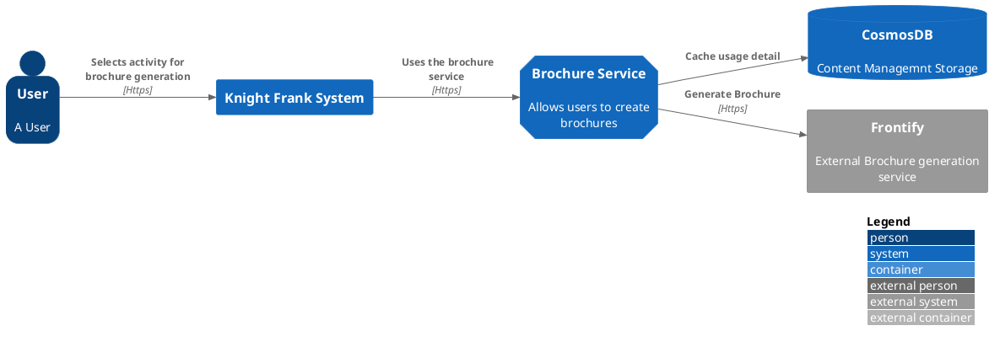
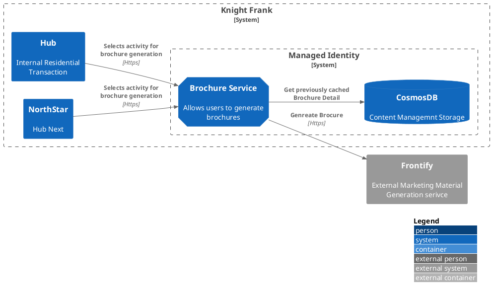

# 3, System Scope and Context

## Business Context

A internal user will have the ability to pass property, text and image information, to this service and receive a brochure that complies with our current marketing guidelines. The user will also have the ability to specify if they want the brochure to be autogenerated or created by hand. The quality and speed being a trade off the transaction owner will have to make. The MarComm(marketing and communications) department will create brochure templates and maintain them to the current standards.

```plant-uml


Bob->Alice : hello


```




## Technical Context



* The API runs as a microservice on our cloud platform, and will be accessible via a API Management interface.
* The connection to the external Address provider is over HTTPS, secured by OAuth2.
* The data passed in this application is not sensitive and doesn't need any encryption protocols.
* Any data retuned by the external provider will be stored, by our document management and scanned for viruses.
* A service bus interface will be available, for asynchronous queueing of jobs.
* A http interface will be available, for ad-hoc querying of information.

| Business Interface         | Channel          |
| -------------------------- | ---------------- |
| API for business functions | internet (https) |
| API for admin / audit      | internet (https) |
| Bulk Updates               | Service Bus      |
