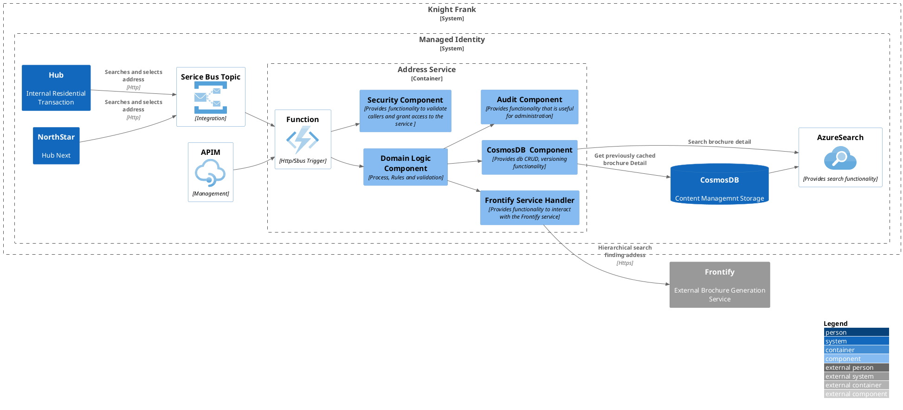
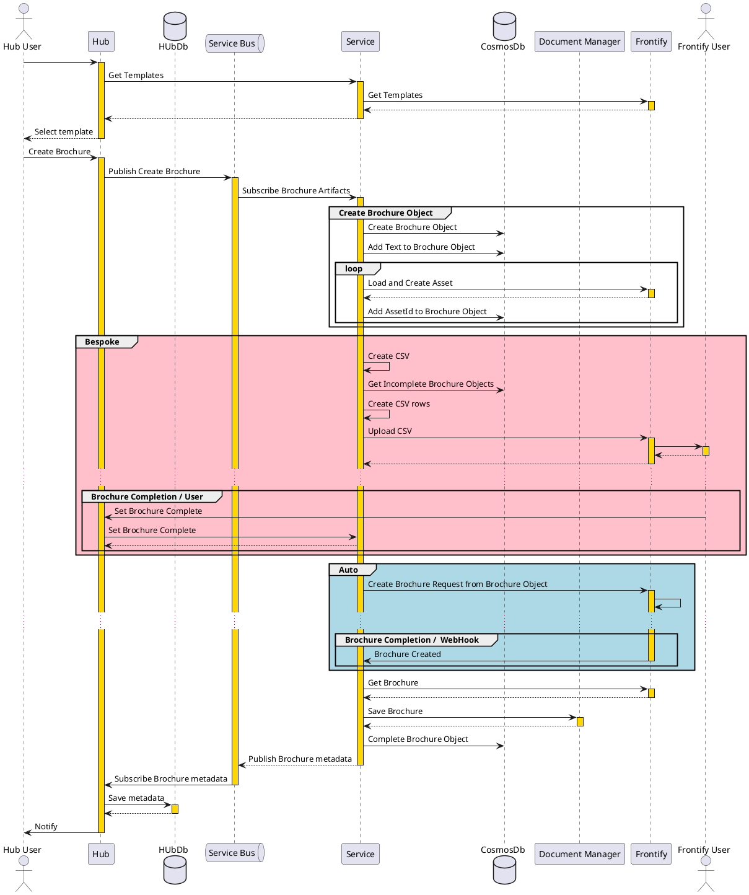

# 5, Building Block View



This service has been designed to handle the interaction with the Frontify brochure generation service. Based on the information supplied the service will determine whether to use the, more automated API service, or the more bespoke CSV file service, which requires a great deal of user interaction.

The service will provide auditing information, which will return information based on the quantity of requests by day/month, and by whom.

### Contained Building Blocks

| **Name**                 | **Responsibility**                                                                       |
| ------------------------ | ---------------------------------------------------------------------------------------- |
| Azure Function           |  Is the interface to all systems. provides both Restful API and Service Bus Interfaces.  |
| Security Component       |  Provides all Managed Identity and User Identity/Access controls                         |
| Audit Component          | Provides a standardised set of audit data retrieval methods, and SOC Alert rules         |
| Cosmos Db Component      | Provides any abstractions or specialisations necessary to access Knight Franks Cosmos DB |
| Frontify Service Handler | Is a specific interface for the Frontify Brochure Generation service.                    |
| Domain Logic Component   | Provides rules and workflow to satisfy the requirements of this service                  |

### Azure Function

The Azure function is the external interface for the service and will support both a RESTful API and a service bus interfaces.

The Service Bus interface is the main interface for creating brochures.

The RESTful API will follow standard REST naming conventions e.g. /Customers or /Customer/{id} to return a collection or a single entity. The RESTful API also employ OPENAPI documentation frames detailing the request and response models, and all return statuses.

## Components

The component libraries should be general and built so they can be copied or included in other projects.

### Security Component

This component will validate the Managed Identity Header. This indicates that the calling application has been authorised to use this service. If a caller fails the Managed Identity authorisation then the method should return a HTTP Status of 401 Unauthorised. If a user token is included, then it should be validated with Entra Id(Active Directory) and the returned claims inspected. Failure should result in a HTTP Status 403 Forbidden.

### Audit Component

Generally all audit components will implement the same API calls, this will allow an admin application to produced consistent reporting across the service estate. The Audit component can supply additional API methods to return specific information that only applies to the current service. The audit interface should be included with the service API, and include calls to return counts based on usage by user/system.

### Cosmos Db Component

This component should utilise the CQRS pattern, All read requests should be serviced by Azure Search queries. Cosmos Db should be implemented with the NoSQL container. This component should use both the Microsoft.Azure.Cosmos and Azure.Identity libraries. The calling client application will be authorised by Managed Identity to access the Cosmos DB. This component should encapsulate any Knight Frank nuances which are general to our usage of Cosmos DB, such as naming conventions or setting configuration.

### Frontfy Service Handler

This service handler will interact with the Frontify Brochure Generation system. All data will be passed to/from this service in a canonical form, so internal systems are not dependant on changes to the Frontify service.

### Domain Logic Component

The domain logic component implements the business requirements of the service. It consists of a workflow and rules. Workflow will not contain rules. The workflow will only ever ask questions of the rules.

### Sequence of Interactions

The sequence diagram below shows the flow calls to Frontify.

The group in red is an area of discussion, as this is the manual, bespoke, process, so the service will not be able to track changes or completion. Meaning the incomplet objects in the datastore will keep building, making the CSV larger and larger.



### Flowchart

```plantuml

start
fork
  : 1, Get Templates;
  Group Hub
    :HUB : Get Templates;
  EndGroup
  Group Service
    :SVC : Get Filterd Templates and details from Frontify;
  EndGroup

fork again
  : 2, Generate Brochure;

  Group Hub
    :Hub : Generate Text and Images;
    :1, Get Template;     
    
    if ( Bespoke? ) then (TRUE)
      :Service Request : Bespoke Flag Set FALSE;
    else (FALSE)
      :Service Request : Bespoke Flag Set TRUE;
    endif
    :Service Request : Set TemplateId;
    :Service Request : Map Text and Images\n into Svc Request with Template Keys;
  Endgroup

  Group Service Bus
    :Pass Service Request;
  Endgroup
  Group Service
    Group Create CosmosDB Brochure Object
    :SVC : Create a Brochure Object in Datastore;
    :SVC : Store Text in Brochure Object;

      Group Asset Upload
        repeat
            :Upload Image to Frontify;
            :Save AssetId in Brochure Object;
        repeat while (More images to upload?) is (yes) not (no)
      EndGroup
    EndGroup

    if (Generate Bespoke Brochure?) then (TRUE)
      Group Generate CSV
        :Get All incomplete BESPOKE Brochures from Datastore;
        :Create CSV;
        repeat
          :Get Brochure Object;
          :CSV: New Row;
          :CSV: Add Texts to matching column heading;
          :CSV: Add AssetIds to matching column heading;
        repeat while (More Brochure Objects?) is (yes) not (no)

        :Upload CSV;
        :User : Generate Brochure;
        :3, Complete Brochure; 
      EndGroup

    else (FALSE)
      Group Auto Generate
        :Using Current Brochure Object;
        :ExportCreative and Associate Assets and Template;
        :Generate Brochure - Returns Brochure Id;
      EndGroup
    Group CleanUp
      :Check Brochure Status;
      :Get Brochure;
      :Store Brochure;
      :Complete Datastore Brochure Object;
    EndGroup

    Group Service Bus
      :Return Brochure Metadata;
    Endgroup
    endif
  EndGroup

fork again
  : 3, Complete Brochure;
  Group Hub
    :HUB : Complete Brochure;
  EndGroup
  Group Service
    :SVC : Mark datastore Brochure Object Complete;
  EndGroup
endfork
stop

```

### Component Detail

1. Azure Function Detail
2. Security Component
3. Service Component
4. Domain Logic Component
5. Cosmos DB Component
