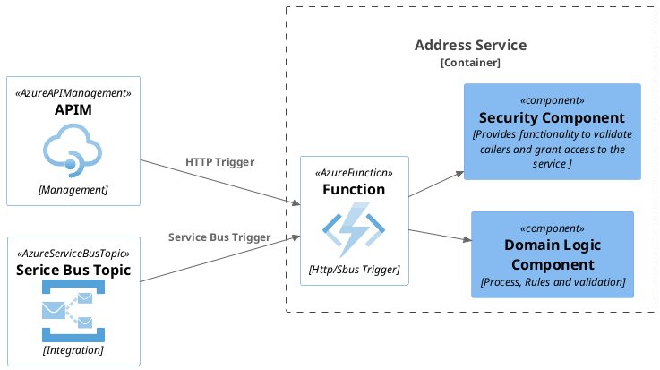
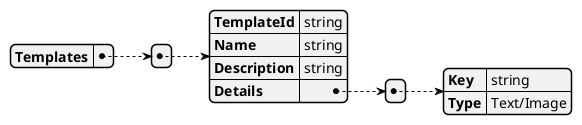
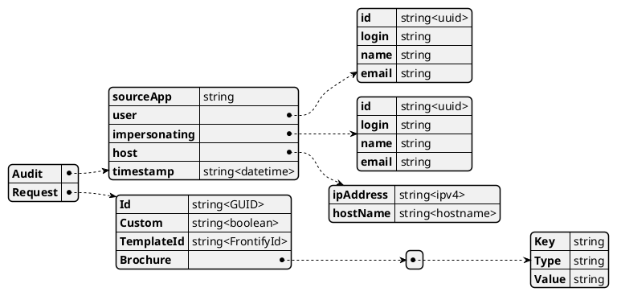
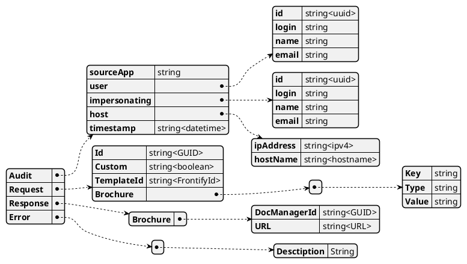

# Azure Function Detail

\[\[TOC]]

### Azure Function



#### RESTFul API

**Brochure**

**Get Templates**

* Returns a list of templates
* Flow

```plantuml
Group Service
  start
    :Get Template request;
    :Get Templates from Frontify;
    :Filter Templates by Auto Generation indicator;
    :Return Template List;
  stop
EndGroup
```

* URL : /Templates
* Parameters : None
* HTTP Method : GET
* Request Body : None
* Response Body
*   HTTP Errors

    | Error | Meaning        |
    | ----- | -------------- |
    | 2xx   | OK(Success)    |
    | 4xx   | User Failure   |
    | 5xx   | System Failure |
* Response Body



**N.B. The Details array forms the Details array of the brochure request.**

**Complete Brochure**

```plantuml
  : 3, Complete Brochure;
  Group Hub
    :HUB : Complete Brochure;
  EndGroup
  Group Service
    :SVC : Mark datastore Brochure Object Complete;
  EndGroup
```

|               |                   |                          |
| ------------- | ----------------- | ------------------------ |
| URL           | /CompleteBrochure |                          |
| Parameters    |                   |                          |
|               | ExternalId        | Id of the calling system |
| HTTP Method   | GET               |                          |
| Request Body  | None              |                          |
| Response Body | None              |                          |
| HTTP Errors   | 2xx               | OK(Success)              |
|               | 4xx               | User Failure             |
|               | 5xx               | System Failure           |

**Audit**

**Get By Source App**

* Returns the count of requests made by source Application
* URL **/SourceApp/**
* HTTP Method **GET**
* Parameters
  * **None** - returns an list of source apps and there counts
  * **SourceApp** - returns the count made by the passed SourceApp
* Request Body **None**
*   Response Body

    ```plantuml
    @startjson
    [
        {
            "SourceApp": "string",
            "Count": "string<number>"
        }
    ]
    @endjson
    ```
*   HTTP Errors

    | Error | Meaning        |
    | ----- | -------------- |
    | 2xx   | OK(Success)    |
    | 4xx   | User Failure   |
    | 5xx   | System Failure |

**Get By User**

* Returns the count of requests made by User
* URL **/User/ param / (optional) Detail**
* HTTP Method **GET**
* Parameters
  * **None** - returns an list of User and their counts
    * Cannot add detail
  * Id\*\* - returns the count made by the passed User
  * **Login** - returns the count made by the passed User
  * **Email** - returns the count made by the passed User
* Request Body **None**
* Response Body
  *   Count Response

      ```plantuml
      @startjson
      {
          "User": {
              "id" : "string<uuid>",
              "login": "string",
              "name": "string",
              "email": "string"
          },
          "Count": "string<number>"
      }
      @endjson
      ```
  *   Detail response

      ```plantuml
      @startjson
      {
          "User": {
              "id" : "string<uuid>",
              "login": "string",
              "name": "string",
              "email": "string"
          },
          "Count": "string<number>",
          "Requests" : [
              {
                  "Id": "string",
                  "When" : "string<DateTime>",
                  "Sourced": "Ext/int"
              }
          ]
      }
      @endjson
      ```
*   HTTP Errors

    | Error | Meaning        |
    | ----- | -------------- |
    | 2xx   | OK(Success)    |
    | 4xx   | User Failure   |
    | 5xx   | System Failure |

**Get By Impersonating**

* Returns the count of requests made by Impersonating
* URL **/Impersonating/ param / (optional) Detail**
* HTTP Method **GET**
* Parameters
  * **None** - returns an list of Impersonating and their counts
    * Cannot add detail
  * **Id** - returns the count made by the passed Impersonating
  * **Login** - returns the count made by the passed Impersonating
  * **Email** - returns the count made by the passed Impersonating
* Request Body **None**
* Response Body
  *   Count Response

      ```plantuml
      @startjson
      {
          "Impersonating": {
              "id" : "string<uuid>",
              "login": "string",
              "name": "string",
              "email": "string"
          },
          "Count": "string<number>"
      }
      @endjson
      ```
  *   Detail response

      ```plantuml
      @startjson
      {
          "Impersonating": {
              "id" : "string<uuid>",
              "login": "string",
              "name": "string",
              "email": "string"
          },
          "Count": "string<number>",
          "Requests" : [
              {
                  "Id": "string",
                  "When" : "string<DateTime>",
                  "Sourced": "Ext/int"
              }
          ]
      }
      @endjson
      ```
*   HTTP Errors

    | Error | Meaning        |
    | ----- | -------------- |
    | 2xx   | OK(Success)    |
    | 4xx   | User Failure   |
    | 5xx   | System Failure |

**Get By Host**

* Returns the count of requests made by Host
* URL **/Host/ param / (optional) Detail**
* HTTP Method **GET**
*   Parameters

    | Parameter     | Description                               | Detail   |
    | ------------- | ----------------------------------------- | -------- |
    | None          | Returns an list of Host and their count   |          |
    | **IpAddress** | Returns the count made by the passed Host | Optional |
    | **hostName**  | Returns the count made by the passed Host | Optional |
* Request Body **None**
*   Errors

    | Http Status Code | Meaning            |
    | ---------------- | ------------------ |
    | 200(OK)          | Success            |
    | 4xx              | User request error |
    | 5xx              | System Error       |
*   Response Body

    | Path                | Type               | Description                                    |
    | ------------------- | ------------------ | ---------------------------------------------- |
    | Host.IpAddress      | string\<ipAddress> | The Ip Address of the requesting host          |
    | Host.hostName       | string             | The name of the requesting host                |
    | Count               | string\<number>    | The total number of requests made              |
    | Requests            | Array              |                                                |
    | Requests\[].Id      | string\<uuid>      | Id of the request                              |
    | Requests\[].When    | string\<DateTime>  | When the request was made                      |
    | Requests\[].Sourced | string             | Ext/Int, was it a external or internal request |

    *   Count Response

        ```plantuml
        @startjson
        {
            "Host":{
                "ipAddress":"string<ipv4>",
                "hostName":"string<hostname>"
            },
            "Count": "string<number>"
        }
        @endjson
        ```
    *   Detail response

        ```plantuml
        @startjson
        {
            "Host":{
                "ipAddress":"string<ipv4>",
                "hostName":"string<hostname>"
            },
            "Count": "string<number>",
            "Requests" : [
                {
                    "Id": "string",
                    "When" : "string<DateTime>",
                    "Sourced": "Ext/int"
                }
            ]
        }
        @endjson
        ```

#### Service Bus

**Request**



| Column     | M/O | Type    | Description                                                      |
| ---------- | --- | ------- | ---------------------------------------------------------------- |
| Id         | M   | Guid    | Unique identifier                                                |
| Custom     | M   | Boolean | Generate a custom brochure (manual)                              |
| TemplateId | O   | string  | Id of the template stored in the Frontify system                 |
| Brochure   | M   |         | Array of Key/Value pairs which make up the body of the brochure. |
|            |     |         | - If the Type is TEXT then value is normal text                  |
|            |     |         | - If the Type is IMAGE then value is could be :-                 |
|            |     |         | - GUID then get the image from the DM                            |
|            |     |         | - Base64 string, it is the image                                 |
|            |     |         | - path then get the image from the OG hub storage (maybe)        |
| Audit      | M   |         | Common Audit information supplied to all services                |

**Response**


