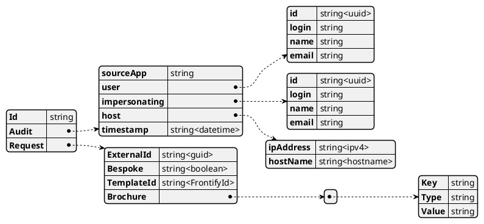
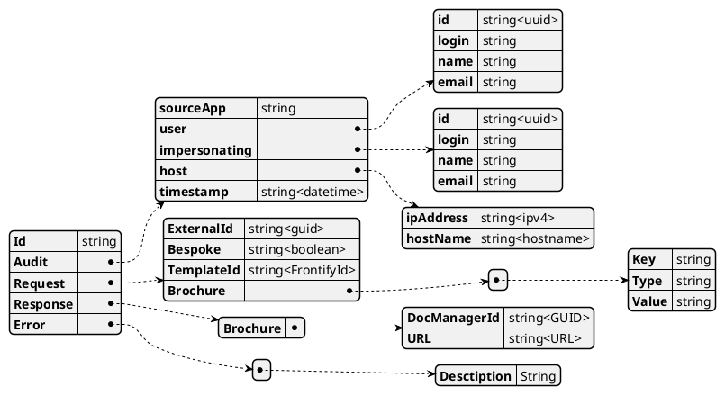

# Domain Logic Component

The domain logic will handle requests from both Service Bus and Ad-hoc via a RESTful API interface. Audit enquires will be routed to the audit component.

## Flowchart

```plantuml

start
fork
  : 1, Get Templates;
  Group Hub
    :HUB : Get Templates;
  EndGroup
  Group Service
    :SVC : Get Filterd Templates and details from Frontify;
  EndGroup

fork again
  : 2, Generate Brochure;

  Group Hub
    :Hub : Generate Text and Images;
    :1, Get Template;     
    
    if ( Bespoke? ) then (TRUE)
      :Service Request : Bespoke Flag Set TRUE;
    else (FALSE)
      :Service Request : Bespoke Flag Set FALSE;
    endif
    :Service Request : Set TemplateId;
    :Service Request : Map Text and Images\n into Svc Request with Template Keys;
  Endgroup

  Group Service Bus
    :Pass Service Request;
  Endgroup
  Group Service
    Group Create CosmosDB Brochure Object
    :SVC : Create a Brochure Object in Datastore;
    :SVC : Store Text in Brochure Object;

      Group Asset Upload
        repeat
            :Upload Image to Frontify;
            :Save AssetId in Brochure Object;
        repeat while (More images to upload?) is (yes) not (no)
      EndGroup
    EndGroup

    if (Generate Bespoke Brochure?) then (TRUE)
      Group Generate CSV
        :Get All incomplete BESPOKE Brochures from Datastore;
        :Create CSV;
        repeat
          :Get Brochure Object;
          :CSV: New Row;
          :CSV: Add Texts to matching column heading;
          :CSV: Add AssetIds to matching column heading;
        repeat while (More Brochure Objects?) is (yes) not (no)

        :Upload CSV;
        :User : Generate Brochure;
        :3, Complete Brochure; 
      EndGroup

    else (FALSE)
      Group Auto Generate
        :Using Current Brochure Object;
        :ExportCreative and Associate Assets and Template;
        :Generate Brochure - Returns Brochure Id;
      EndGroup
    Group CleanUp
      :Check Brochure Status;
      :Get Brochure;
      :Store Brochure;
      :Complete Datastore Brochure Object;
    EndGroup

    Group Service Bus
      :Return Brochure Metadata;
    Endgroup
    endif
  EndGroup

fork again
  : 3, Complete Brochure;
  Group Hub
    :HUB : Complete Brochure;
  EndGroup
  Group Service
    :SVC : Mark datastore Brochure Object Complete;
  EndGroup
endfork
stop

```

## Schemas and Maps

This service takes a standard integration approach to mapping internal and external data structures, this design breaks dependencies so that the external interface may change without affecting internal systems.

Objects received from interfaces should follow a standard VETER integration pattern (Validate, Extract, Transform, Enrich, Route)

* Validate
  * Objects should be validated and a default rules set should be applied to validate the object.
* Extract
  * Extract specific information from the message, such as audit etc.
* TransForm
  * The Message should be transformed into the next type in the process.
* Enrich
  * Adds additional data to the message, often from external sources
* Route
  * Directs the processed message to the appropriate destination based on certain criteria.

```plantuml
@startuml
!includeurl https://raw.githubusercontent.com/plantuml-stdlib/EIP-PlantUML/main/dist/EIP-PlantUML.puml
!include <C4/C4_Component>
AddElementTag("storage", $shape=RoundedBoxShape(), $fontColor="white")
LAYOUT_TOP_DOWN()

MessageEndpoint( svc, "Service Request" )
Message( req, "Request")
Message( loq, "Frontify Request")
MessageEndpoint(frontify, "Frontify Request" )

System_Boundary(c1, "Domain") {
    SelectiveConsumer(reqval, "Validation")
    MessageTranslator( req2con, "Request to Canonical")
    MessageTranslator( con2loq, "Canonical to Frontify")
    Message( con, "Canonical")
    Message( conr, "Canonical")
    MessageTranslator( loqr2conr, "Frontify Response to Canonical")
    SelectiveConsumer(resval, "Validation")

    con -- conr
}
SystemDb(cosmos, "CosmosDB", "Content Managemnt Storage", $tags = "storage")
conr --> cosmos

MessageEndpoint( svcr, "Service Response" )
Message( res, "Response")
Message( loqr, "Frontify Response")
MessageEndpoint(frontifyr, "Frontify Response" )

svc -> req
req -> reqval
reqval -> req2con
req2con -> con
con -> con2loq
con2loq -> loq
loq -> frontify

req -[hidden]-> res

svcr <- res
res <- conr
conr <- loqr2conr
loqr2conr <- resval
resval <- loqr
loqr <- frontifyr

@enduml
```

## Brochure Generation

### Request Schema



### Validation Rules

* Given : A Brochure Generation Request
* When : ID is a GUID
* AND : Audit Is Valid
  * SourceApp is not Null
  * User is not Null
  * host is not Null
  * TimeStamp is valid today, current hour
* AND : Request is Valid
  * ExternalId is not Null, GUID
  * Bespoke is True or False
  * TemplateId is Frontify Id
  * Brochure array is Valid
    * Array of Key/Type/Value tuples
* Then : I can generate a brochure

### Response Schema


