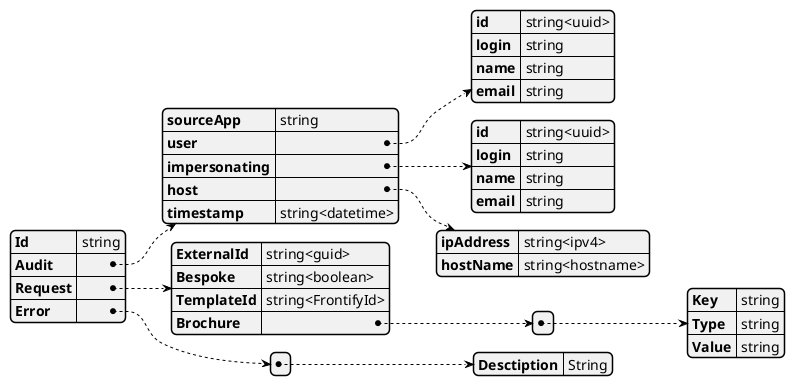

# Cosmos Db Component

A NoSql Cosmos DB container should be used as this service is similar in operation to other services, and also due to the variable length of Brochure array.

## Containers

```plantuml
@startjson
{
    "Id" : "string",
    "Audit": {
        "sourceApp": "string",
        "user": {
            "id" : "string<uuid>",
            "login": "string",
            "name": "string",
            "email": "string"
        },
        "impersonating": {
            "id" : "string<uuid>",
            "login": "string",
            "name": "string",
            "email": "string"
        },
        "host":{
            "ipAddress":"string<ipv4>",
            "hostName":"string<hostname>"
        },
        "timestamp": "string<datetime>"
    },
    "Request" : {
        "ExternalId": "string<guid>",
        "Bespoke" : "string<boolean>",
        "TemplateId": "string<FrontifyId>",
        "Brochure": [
            { 
              "Key": "string",
              "Type": "string",
              "Value": "string"
            }
        ]
    },
    "Error" : [
      {
        "Desctiption" : "String"
      }
    ]    
}
@endjson
```
